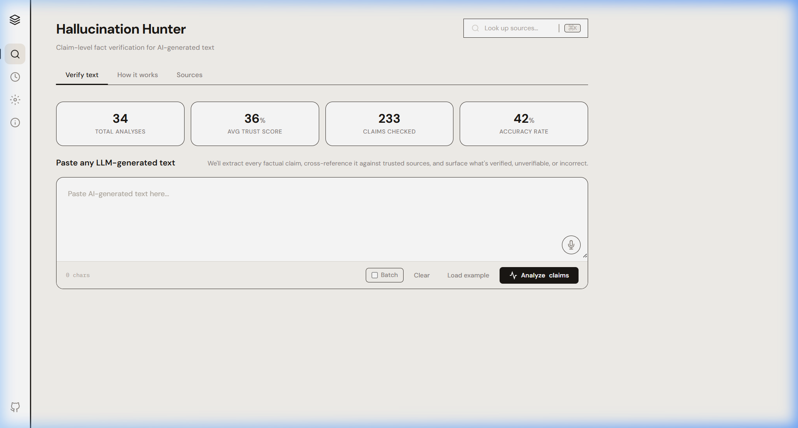
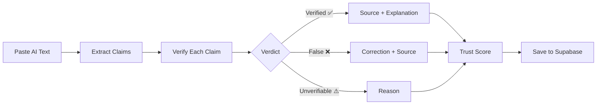

<div align="center">

# 🔍 Hallucination Hunter

### Claim-level Fact Verification for AI-Generated Text

[](https://opensource.org/licenses/MIT)
[](https://developer.mozilla.org/en-US/docs/Web/JavaScript)
[](https://supabase.com)
[](https://groq.com)

**Splits AI-generated text into individual claims, verifies each against trusted sources, and provides a trust score with detailed evidence.**

[Live Demo](#-quick-start) · [Features](#-features) · [Architecture](#-architecture) · [Setup](#-getting-started)

</div>

---



##  The Problem

Large Language Models (LLMs) generate confident-sounding text that may contain **factual errors, outdated information, or complete fabrications** — known as *hallucinations*. There's no easy way to verify which parts of an AI response are accurate and which are not.

##  The Solution

**Hallucination Hunter** breaks down AI-generated text into individual, verifiable claims and fact-checks each one independently using LLM-powered verification with source attribution.

---

##  Features

### Core Functionality
| Feature | Description |
|---------|-------------|
|  **Claim Extraction** | Automatically splits text into atomic, verifiable factual claims |
|  **Multi-Claim Verification** | Each claim is independently verified against real-world knowledge |
|  **Trust Score** | Overall reliability score (0-100%) based on verified vs false claims |
|  **Source Attribution** | Every verification includes source URLs and explanations |
|  **Annotated Text** | Original text highlighted with inline verification results |

### Application Features
| Feature | Description |
|---------|-------------|
| 🔍 **Global Search** | Real-time search across all analyses, claims, and sources (Ctrl+K) |
| 📜 **Analysis History** | Complete history stored in Supabase with detail view |
| 📚 **Source Library** | Track all sources used across verifications |
| ⚙️ **Settings** | Configure API keys, database connection, and preferences |
| 📱 **Mobile Responsive** | Full mobile support with sticky bottom navigation |
| 🎨 **Premium UI** | Earthy, warm-toned design inspired by Linear & Untitled UI |

### Search Features
- **Animated search bar** with typing placeholder on page load
- **Keyboard shortcut** — `Ctrl+K` / `⌘K` to open search
- **Live results** — debounced real-time search as you type
- **Three categories** — Analyses 📊, Claims 💬, Sources 🔗
- **Text highlighting** — matching terms highlighted in results
- **Quick navigation** — click result to jump to the analysis

---

##  Architecture

```
┌─────────────────────────────────────────────────┐
│                  Frontend (SPA)                  │
│         HTML + CSS + Vanilla JavaScript          │
├─────────────────────────────────────────────────┤
│                                                  │
│   ┌──────────┐  ┌──────────┐  ┌──────────────┐  │
│   │ Analyzer │  │ History  │  │   Settings   │  │
│   │   View   │  │   View   │  │     View     │  │
│   └────┬─────┘  └────┬─────┘  └──────┬───────┘  │
│        │              │               │          │
│   ┌────┴──────────────┴───────────────┴───────┐  │
│   │          Supabase Client SDK              │  │
│   └────────────────┬──────────────────────────┘  │
│                    │                             │
├────────────────────┼─────────────────────────────┤
│                    ▼                             │
│   ┌────────────────────────────────────────┐     │
│   │         Supabase (PostgreSQL)          │     │
│   │                                        │     │
│   │  ┌───────────┐  ┌─────────┐           │     │
│   │  │ analyses  │  │ claims  │           │     │
│   │  │           │  │         │           │     │
│   │  │ id        │  │ id      │           │     │
│   │  │ input_text│──│ analysis│           │     │
│   │  │ trust_    │  │ _id     │           │     │
│   │  │   score   │  │ claim_  │           │     │
│   │  │ total_    │  │   text  │           │     │
│   │  │   claims  │  │ status  │           │     │
│   │  │ created_at│  │ source_ │           │     │
│   │  └───────────┘  │   url   │           │     │
│   │                  └─────────┘           │     │
│   └────────────────────────────────────────┘     │
│                                                  │
│   ┌────────────────────────────────────────┐     │
│   │         Groq API (LLM Engine)          │     │
│   │                                        │     │
│   │  Step 1: Extract claims from text      │     │
│   │  Step 2: Verify each claim             │     │
│   │  Step 3: Return verdicts + sources     │     │
│   └────────────────────────────────────────┘     │
│                                                  │
└─────────────────────────────────────────────────┘
```

---

##  Getting Started

### Prerequisites

- A modern web browser (Chrome, Firefox, Edge, Safari)
- [Node.js](https://nodejs.org/) (for the local dev server)
- A [Groq API Key](https://console.groq.com/) (free tier available)
- A [Supabase](https://supabase.com/) project (free tier available)

### 1. Clone the repository

```bash
git clone https://github.com/Sunil56224972/hallucination-Hunter.git
cd hallucination-Hunter
```

### 2. Set up Supabase

Create these tables in your Supabase SQL Editor:

```sql
-- Analyses table
CREATE TABLE analyses (
  id UUID DEFAULT gen_random_uuid() PRIMARY KEY,
  input_text TEXT NOT NULL,
  trust_score INTEGER,
  total_claims INTEGER DEFAULT 0,
  verified_count INTEGER DEFAULT 0,
  unverifiable_count INTEGER DEFAULT 0,
  false_count INTEGER DEFAULT 0,
  created_at TIMESTAMPTZ DEFAULT now()
);

-- Claims table
CREATE TABLE claims (
  id UUID DEFAULT gen_random_uuid() PRIMARY KEY,
  analysis_id UUID REFERENCES analyses(id) ON DELETE CASCADE,
  claim_text TEXT NOT NULL,
  status TEXT DEFAULT 'unverifiable',
  confidence REAL,
  explanation TEXT,
  source_name TEXT,
  source_url TEXT,
  created_at TIMESTAMPTZ DEFAULT now()
);

-- Settings table
CREATE TABLE settings (
  key TEXT PRIMARY KEY,
  value TEXT,
  updated_at TIMESTAMPTZ DEFAULT now()
);
```

### 3. Configure API keys

Open `app.js` and update the Supabase credentials at the top:

```javascript
const SUPABASE_URL = 'https://your-project.supabase.co';
const SUPABASE_KEY = 'your-anon-key';
```

Add your Groq API key in the app's **Settings → API** page.

### 4. Run locally

```bash
npx http-server . -p 8080 --cors -c-1
```

Open `http://localhost:8080` in your browser.

---

##  Tech Stack

| Layer | Technology |
|-------|------------|
| **Frontend** | HTML5, CSS3 (Vanilla), JavaScript (ES6+) |
| **Database** | [Supabase](https://supabase.com/) (PostgreSQL) |
| **LLM API** | [Groq](https://groq.com/) (Llama 3 / Mixtral) |
| **Typography** | [DM Sans](https://fonts.google.com/specimen/DM+Sans) + [IBM Plex Mono](https://fonts.google.com/specimen/IBM+Plex+Mono) |
| **Hosting** | Static — deploy anywhere (Vercel, Netlify, GitHub Pages) |

---

##  Project Structure

```
hallucination-Hunter/
├── index.html          # Main SPA entry point
├── style.css           # Complete design system + responsive styles
├── app.js              # Application logic, Supabase client, Groq API
├── Search.gif          # Animated search bar asset
├── verified-icon.png   # ✅ Verified claim icon
├── incorrect-icon.png  # ❌ False claim icon
├── unverifiable-icon.png # ⚠️ Unverifiable claim icon
├── screenshots/        # App screenshots for README
│   └── app-main.png
└── README.md
```

---

##  How It Works



1. **Paste** — User pastes AI-generated text into the analyzer
2. **Extract** — Groq LLM extracts individual factual claims
3. **Verify** — Each claim is independently fact-checked by the LLM
4. **Score** — Trust score calculated as `(verified / total) × 100`
5. **Store** — Results saved to Supabase for future reference

---

##  Design Philosophy

- **Earthy & Warm** — Inspired by Linear and Untitled UI's clean aesthetic
- **No Fake Features** — Every button, tab, and function is real and working
- **Human-Like** — Designed to feel like a mature, polished SaaS product
- **Mobile-First** — Responsive design with dedicated mobile navigation

---

##  License

This project is licensed under the MIT License — see the [LICENSE](LICENSE) file for details.

---

##  Contributing

Contributions are welcome! Feel free to:

1. Fork the repository
2. Create a feature branch (`git checkout -b feature/amazing-feature`)
3. Commit your changes (`git commit -m 'Add amazing feature'`)
4. Push to the branch (`git push origin feature/amazing-feature`)
5. Open a Pull Request

---

<div align="center">

**Built with ❤️ by [Sunil](https://github.com/Sunil56224972)**

*Hallucination Hunter — Because AI should be accurate, not just confident.*

</div>
