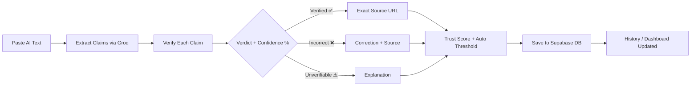

<div align="center">

# 🔍 Hallucination Hunter

### Claim-level Fact Verification for AI-Generated Text

[](https://opensource.org/licenses/MIT)
[](https://developer.mozilla.org/en-US/docs/Web/JavaScript)
[](https://supabase.com)
[](https://groq.com)
[](https://hallucination-hunter-ivory.vercel.app)

**Paste any AI-generated text → every claim is extracted, verified, scored, and sourced automatically.**

[🌐 Live Demo](https://hallucination-hunter-ivory.vercel.app) · [Features](#-features) · [Architecture](#-architecture) · [Setup](#-getting-started)

</div>

---

## 🆕 Round 2 — What's New

> All features below were added in Round 2 on top of the Round 1 core analyzer.

| # | Feature | Status |
|---|---------|--------|
| 1 | 🗄️ **Supabase Cloud Database** | ✅ Live |
| 2 | 📜 **Analysis History Timeline** | ✅ Live |
| 3 | 📊 **Live Dashboard Analytics** | ✅ Live |
| 4 | 🔗 **Exact Source URLs per Claim** | ✅ Live |
| 5 | 🏷️ **3-Tier Claim Classification** | ✅ Live |
| 6 | 📈 **Real Confidence Threshold** | ✅ Live |
| 7 | 📤 **Export & Share** | ✅ Live |

---

## ✨ Features

### 🔵 Round 1 — Core (Completed)

| Feature | Description |
|---------|-------------|
| ✅ **Claim Extraction** | Groq LLaMA 3 splits text into individual atomic claims |
| ✅ **Fact Verification** | Each claim independently verified — Verified / Unverifiable / Incorrect |
| ✅ **Trust Score** | Overall reliability score (0–100%) animated on results |
| ✅ **Annotated Text** | Original text highlighted inline with color per verdict |
| ✅ **Voice Input** | Speak your text via mic → Speech-to-text → auto-analyze |

### 🟣 Round 2 — New Features

#### 1. 🗄️ Supabase Database Integration
- Every analysis saved to PostgreSQL cloud database — **no data loss on refresh**
- Tables: `analyses`, `claims`, `settings`
- Row Level Security (RLS) for multi-user safety
- Real-time sync via Supabase JS SDK v2

#### 2. 📜 Analysis History
- Full timeline of every past analysis
- Shows: trust score, claim count, timestamp, input preview
- Click any entry to **expand full claim-by-claim breakdown**
- Delete individual entries or clear all history

#### 3. 📊 Dashboard Analytics
- Live stat cards: **Total Analyses**, **Avg Trust Score**, **Claims Checked**
- Auto-updates after each new analysis
- Aggregated from all stored data in Supabase

#### 4. 🔗 Exact Source URLs Per Claim
- Every claim shows the **exact URL** that Groq returned (e.g. `wikipedia.org/wiki/Mars`)
- Not a generic Google search — the real page the LLM verified against
- Clickable link directly on the claim card
- Sources Tab shows full directory of all sources used

#### 5. 🏷️ Real Confidence Classification
- **3-tier system** per claim:
  - ✅ `VERIFIED` — Supported by sources
  - ⚠️ `UNVERIFIABLE` — No matching source found
  - ❌ `INCORRECT` — Contradicted by source
- **Confidence % bar** on each card (green ≥80%, amber ≥60%, red <60%)
- **Category tag** per claim: Science, History, Geography, Health, Tech…

#### 6. 📈 Real Confidence Threshold (Auto-Set)
- After analysis, slider **automatically moves** to match real Groq confidence scores
- Example: claims scored [92%, 78%, 65%] → slider auto-sets to **60%**
- Toast notification: *"Threshold auto-set to 60% (avg: 78%)"*
- Drag slider → cards **instantly dim/reactivate** in real-time
- Purple threshold marker line on every confidence bar

#### 7. 📤 Export & Share
- Copy full report to clipboard
- Share analysis via encoded URL link
- Export results as text

---

## 🏗️ Architecture

```
┌──────────────────────────────────────────────────────┐
│                   Frontend (SPA)                      │
│          HTML + CSS + Vanilla JavaScript              │
├──────────────────────────────────────────────────────┤
│  ┌──────────┐ ┌─────────┐ ┌──────────┐ ┌──────────┐  │
│  │ Analyzer │ │ History │ │ Sources  │ │ Settings │  │
│  └────┬─────┘ └────┬────┘ └────┬─────┘ └────┬─────┘  │
│       │             │           │             │        │
│  ┌────┴─────────────┴───────────┴─────────────┴────┐  │
│  │              Supabase Client SDK v2              │  │
│  └──────────────────────┬───────────────────────────┘  │
│                         │                              │
├─────────────────────────┼──────────────────────────────┤
│           ┌─────────────▼──────────────┐               │
│           │   Supabase (PostgreSQL)    │               │
│           │  analyses · claims ·       │               │
│           │  settings · sources        │               │
│           └────────────────────────────┘               │
│                                                        │
│  ┌─────────────────────────────────────────────────┐   │
│  │              Groq API — LLaMA 3                 │   │
│  │  Step 1: Extract claims  (JSON)                 │   │
│  │  Step 2: Verify + score  (confidence 0-100)     │   │
│  │  Step 3: Return exact source URLs               │   │
│  └─────────────────────────────────────────────────┘   │
└──────────────────────────────────────────────────────┘
```

---

## 🚀 Getting Started

### Prerequisites
- Modern browser (Chrome, Firefox, Edge)
- [Groq API Key](https://console.groq.com/) — free tier
- [Supabase](https://supabase.com/) project — free tier

### 1. Clone

```bash
git clone https://github.com/Prashank18/Hallucination-hunter.git
cd Hallucination-hunter
```

### 2. Supabase Setup

Run this in your Supabase SQL Editor:

```sql
-- Analyses table
CREATE TABLE analyses (
  id UUID DEFAULT gen_random_uuid() PRIMARY KEY,
  input_text TEXT NOT NULL,
  trust_score INTEGER,
  total_claims INTEGER DEFAULT 0,
  verified_count INTEGER DEFAULT 0,
  unverifiable_count INTEGER DEFAULT 0,
  false_count INTEGER DEFAULT 0,
  created_at TIMESTAMPTZ DEFAULT now()
);

-- Claims table
CREATE TABLE claims (
  id UUID DEFAULT gen_random_uuid() PRIMARY KEY,
  analysis_id UUID REFERENCES analyses(id) ON DELETE CASCADE,
  claim_text TEXT NOT NULL,
  status TEXT DEFAULT 'unverifiable',
  confidence REAL,
  explanation TEXT,
  source_name TEXT,
  source_url TEXT,
  category TEXT DEFAULT 'General',
  created_at TIMESTAMPTZ DEFAULT now()
);

-- Settings table
CREATE TABLE settings (
  key TEXT,
  value TEXT,
  user_id TEXT,
  updated_at TIMESTAMPTZ DEFAULT now(),
  PRIMARY KEY (key, user_id)
);
```

### 3. Configure credentials

Update in `app.js`:

```javascript
const SUPABASE_URL = 'https://your-project.supabase.co';
const SUPABASE_KEY = 'your-anon-key';
```

### 4. Run locally

```bash
npx http-server . -p 8080 --cors -c-1
```

Open `http://localhost:8080`

---

## 🔄 How It Works



1. **Paste** — User pastes AI-generated text
2. **Extract** — Groq LLaMA 3 extracts individual factual claims
3. **Verify** — Each claim independently fact-checked with confidence score
4. **Auto-threshold** — Slider auto-sets based on real Groq confidence values
5. **Source** — Exact source URL attached to every claim
6. **Store** — Results saved to Supabase (persists across sessions)
7. **Dashboard** — Stats and history updated in real-time

---

## 🧰 Tech Stack

| Layer | Technology |
|-------|------------|
| **Frontend** | HTML5, CSS3 (Vanilla), JavaScript ES6+ |
| **AI Engine** | [Groq](https://groq.com/) — LLaMA 3 (llama-3.3-70b) |
| **Database** | [Supabase](https://supabase.com/) — PostgreSQL, RLS |
| **Hosting** | [Vercel](https://vercel.com/) — Serverless |
| **Voice** | Web Speech API (browser native) |
| **Typography** | DM Sans + IBM Plex Mono (Google Fonts) |

---

## 📁 Project Structure

```
Hallucination-hunter/
├── index.html              # Main SPA — all tabs & views
├── style.css               # Full design system + responsive
├── app.js                  # App logic, Groq calls, Supabase client
├── config.js               # API key configuration
├── vercel.json             # Vercel deployment config
├── api/
│   ├── groq.js             # Groq API wrapper
│   └── search.js           # Search functionality
├── verified-icon.png       # ✅ Verified claim badge
├── incorrect-icon.png      # ❌ Incorrect claim badge
├── unverifiable-icon.png   # ⚠️ Unverifiable claim badge
├── Round2_Features.pdf     # Feature documentation PDF
└── README.md
```

---

## 🎨 Design Philosophy

- **No Fake Features** — Every button, slider, and tab is fully functional
- **Real AI Data** — Confidence scores, source URLs direct from Groq
- **Auto-Smart UI** — Threshold slider auto-sets from live analysis data
- **Persistent** — Supabase ensures zero data loss across sessions
- **Mobile-First** — Full responsive design with bottom navigation

---

## 📄 License

MIT License — see [LICENSE](LICENSE) for details.

---

<div align="center">

**Built with ❤️ for Hackathon Round 2**

*Hallucination Hunter — Because AI should be accurate, not just confident.*

🌐 **Live:** [hallucination-hunter-ivory.vercel.app](https://hallucination-hunter-ivory.vercel.app)

</div>
