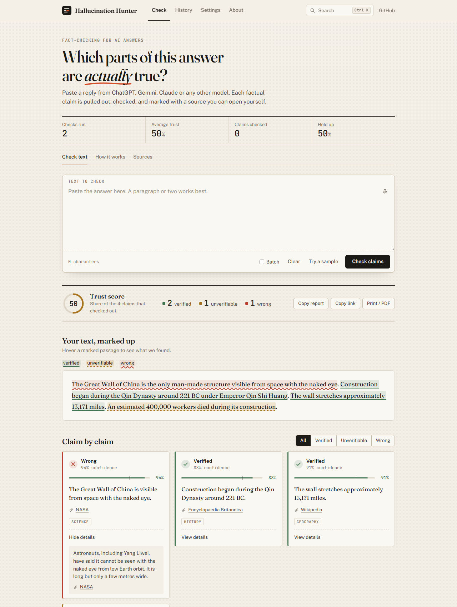

<p align="center">
  
</p>

<h1 align="center">Hallucination Hunter</h1>

<p align="center">
  Claim-level fact verification engine for AI-generated text.<br>
  <em>Don't Trust. Verify.</em>
</p>

<p align="center">
  <a href="https://hallucination-hunter-five.vercel.app">Live Demo</a> &middot;
  <a href="#features">Features</a> &middot;
  <a href="#architecture">Architecture</a> &middot;
  <a href="#getting-started">Getting Started</a> &middot;
  <a href="#chrome-extension">Chrome Extension</a>
</p>

---

## Problem

Large Language Models generate text that sounds authoritative but contains fabricated facts — known as **hallucinations**. Studies estimate 5–15% of AI-generated factual claims are incorrect, yet most users have no practical way to verify them.

Existing tools only detect whether text was *written by AI*. They don't tell you **which specific facts are wrong**.

## Solution

Hallucination Hunter splits AI-generated text into individual factual claims and verifies each one independently. Every claim receives a verdict (`Verified`, `Unverifiable`, or `Wrong`), a confidence score, source attribution, and — when applicable — an auto-correction with the accurate fact.

Analysis completes in under 2 seconds using Groq's LPU inference hardware.

<p align="center">
  
</p>

---

## Features

### Analysis Engine

- **Claim extraction** — AI identifies every discrete factual statement in the input text
- **Independent verification** — each claim verified separately with confidence scoring (0–100%)
- **Auto-correction** — incorrect claims are rewritten with accurate information
- **Source attribution** — claims linked to trusted references (Wikipedia, WHO, NASA, etc.)
- **Trust score** — aggregate reliability metric with visual breakdown

### User Interface

- **Voice input** — dictate text using Web Speech API
- **Batch mode** — analyze multiple text blocks simultaneously
- **Filter tabs** — view All / Verified / Unverifiable / Wrong claims
- **Annotated text** — original text highlighted inline with color-coded claim markers
- **Example loader** — pre-loaded samples for quick demonstration
- **Light and dark themes** — follows the system setting, or pick one in Settings
- **Keyboard first** — `Ctrl+Enter` to check, `/` to focus the text box, `Ctrl+K` to search, `?` for the full list
- **Cancel and retry** — stop a running check with `Esc`; failed checks offer a one-click retry
- **Draft autosave** — unfinished text survives a reload
- **Deep links** — `#/history`, `#/settings`, `#/about` work with Back/Forward

### Export and Sharing

- **PDF report** — downloadable fact-check report
- **Copy results** — one-click copy of annotated analysis
- **Share via URL** — generate a shareable link to any analysis result
- **Markdown export** — download the report as a `.md` file
- **History export** — download every saved check as JSON

### Data Persistence

- **Cloud storage** — analysis history stored in Supabase (PostgreSQL)
- **User isolation** — anonymous UUID-based data separation
- **Dashboard** — aggregate statistics: total analyses, accuracy rate, category breakdown
- **History browser** — search, filter, and revisit past analyses
- **Undo delete** — removed checks can be restored for a few seconds

### Platform Coverage

- **Web application** — responsive, works on desktop and mobile browsers
- **Installable app (PWA)** — service worker keeps the app shell available offline
- **Chrome extension** — Manifest V3; right-click any selection to check it, no API key needed
- **Mobile layout** — touch-friendly navigation with bottom tab bar

---

## Architecture

```
                         User Interface
          ┌────────────────┬────────────────┐
          │    Web App     │  Chrome Ext    │
          │  (index.html)  │  (popup.html)  │
          └───────┬────────┴───────┬────────┘
                  │                │
                  └────────┬───────┘
                           │
                     ┌─────▼─────┐
                     │  app.js   │
                     │  Engine   │
                     └─────┬─────┘
                           │
             ┌─────────────┼─────────────┐
             │             │             │
    ┌────────▼────────┐    │    ┌────────▼────────┐
    │  /api/groq.js   │    │    │    Supabase     │
    │  Vercel Proxy   │    │    │   PostgreSQL    │
    │  Rate limiting  │    │    │  History/Stats  │
    └────────┬────────┘    │    └─────────────────┘
             │             │
    ┌────────▼────────┐    │
    │    Groq API     │    │
    │  gpt-oss-120b   │    │
    │   (LPU Cloud)   │    │
    └─────────────────┘    │
                           │
                  ┌────────▼────────┐
                  │  /api/search.js │
                  │  Source lookup  │
                  └─────────────────┘
```

**Data flow:**
```
User input → Claim extraction → Per-claim verification → Source search
  → Trust score calculation → Visual results → Cloud storage
```

---

## Tech Stack

| Layer | Technology | Rationale |
|-------|-----------|-----------|
| Frontend | HTML5, CSS3, Vanilla JS | Zero-dependency, fast load times |
| AI Model | GPT-OSS-120B | 120B parameter model, high factual accuracy |
| Inference | Groq LPU | ~500 tokens/sec, sub-2s end-to-end |
| Backend | Vercel Serverless | Auto-scaling edge functions |
| Database | Supabase (PostgreSQL) | Real-time subscriptions, row-level security |
| Extension | Chrome Manifest V3 | Modern security model, cross-browser |
| Search | Google Custom Search | Live source verification |

---

## Getting Started

**Prerequisites:** Node.js 18+, a Groq API key from [console.groq.com](https://console.groq.com)

```bash
# Clone
git clone https://github.com/Sunil56224972/hallucination-Hunter.git
cd hallucination-Hunter

# Run
npx live-server --port=3000
```

Open `http://localhost:3000`, paste any AI-generated text, click **Check claims**. Local runs use the hosted proxy, so no key is needed. To call Groq directly while developing, set `window.GROQ_API_KEY` in the browser console before checking.

**Vercel deployment** — add `GROQ_API_KEY` as an environment variable in the Vercel dashboard.

---

## Chrome Extension

The browser extension allows fact-checking on any website without navigating away from the page.

**Capabilities:**
- Select text, right-click, **Check with Hallucination Hunter**
- Or copy text and press `Alt+Shift+H`; the popup pre-fills it
- Filter claims, copy a plain-text report, or open the result in the full app
- The last result is kept when the popup closes
- Calls the hosted proxy, so the extension ships no API key

**Install (developer mode):**
1. Navigate to `chrome://extensions/`
2. Enable **Developer mode**
3. Click **Load unpacked** and select the `chrome-extension/` directory
4. Pin the extension in the toolbar
5. After pulling updates, press the reload icon on the extension card

Works on Chrome, Edge, Brave, Opera, and other Chromium-based browsers.

---

## Icons and Android build

The mark is a dark tile with three lines of text, one struck in red. All sizes are generated from the same source:

- `assets/` - favicon, apple-touch icon and PWA icons used by `manifest.webmanifest`
- `chrome-extension/icons/` - 16, 32, 48 and 128 px extension icons
- `resources/` - source artwork for the Android app (Capacitor)

The Android app wraps the web app, so UI changes ship with it. To regenerate launcher and splash icons after changing the artwork:

```bash
npx @capacitor/assets generate --android
npx cap sync android
```

---

## Project Structure

```
hallucination-Hunter/
├── index.html                  Main application
├── app.js                      Core engine
├── style.css                   Design system (light and dark)
├── sw.js                       Offline support
├── vercel.json                 Deployment configuration
├── api/
│   ├── groq.js                 AI proxy with rate limiting
│   └── search.js               Source search endpoint
├── chrome-extension/
│   ├── manifest.json           MV3 configuration
│   ├── popup.html / css / js   Extension UI and logic
│   ├── content.js              Page-level text capture
│   └── background.js           Service worker
└── screenshots/                Application screenshots
```

---

## Security

| Concern | Implementation |
|---------|---------------|
| API key exposure | Key lives only in the Vercel environment; web app, Android app and extension all go through `/api/groq` |
| Abuse prevention | Rate limiting: 10 requests/min per IP |
| Input validation | 20,000 character limit, model whitelist |
| Cross-origin access | CORS enforcement in serverless proxy |
| Transport security | HSTS, X-Frame-Options, CSP headers |
| Extension permissions | `activeTab`, `storage`, `contextMenus`, and host access to the app's own proxy only |

---

## How Verification Works

```
Input:
  "The Great Wall of China is visible from space and was built in 1420."

Step 1 — Claim Extraction:
  [1] "The Great Wall of China is visible from space"
  [2] "The Great Wall was built in 1420"

Step 2 — Verification:
  [1] INCORRECT  (confidence: 95%)
      Correction: Not visible to the naked eye from low Earth orbit.
      Source: NASA

  [2] UNVERIFIABLE  (confidence: 40%)
      Note: Construction began in 7th century BC; major rebuilding
      occurred under the Ming dynasty (1368–1644).
      Source: Encyclopedia Britannica

Step 3 — Trust Score:
  25% — 0 verified, 1 unverifiable, 1 incorrect
```

---

## Contributing

See [CONTRIBUTING.md](CONTRIBUTING.md) for setup instructions and guidelines.

## License

MIT — see [LICENSE](LICENSE).

---

<p align="center">
  <sub>Built for truth in the age of AI.</sub>
</p>
